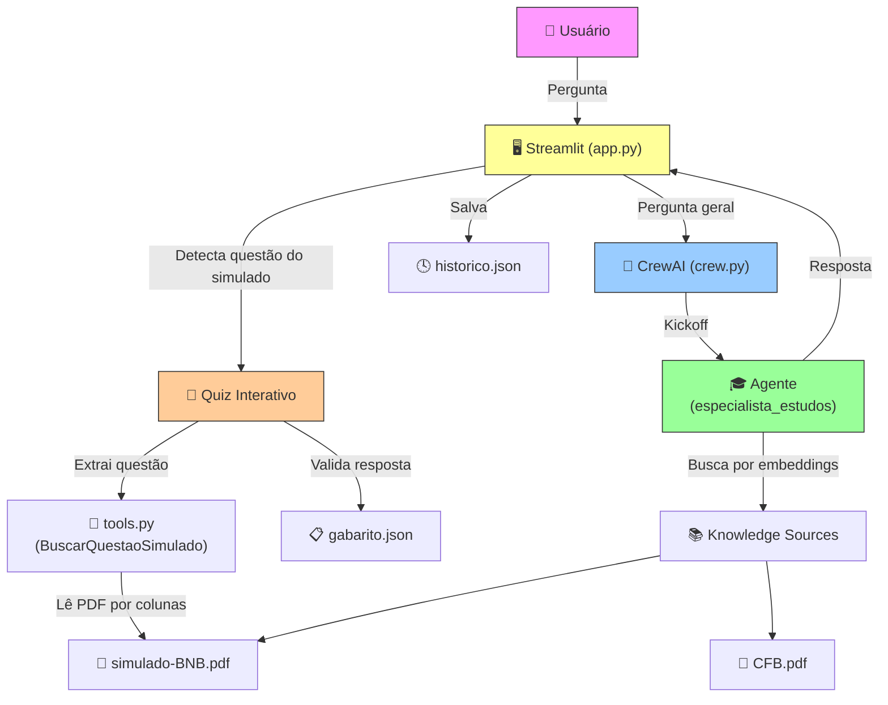

# ⚖️ Agente de Estudos

Assistente inteligente para preparação de concursos públicos, construído com **CrewAI**, **Streamlit** e **GPT-5**. O agente responde perguntas sobre a Constituição Federal de 1988 e permite praticar questões do Simulado BNB com quiz interativo.

## 📸 Funcionalidades

- **Consulta à Constituição Federal** — Respostas curtas e diretas sobre artigos e princípios da CF/88
- **Simulado BNB interativo** — Exibe questões do simulado com alternativas e identifica o assunto abordado
- **Quiz com validação** — Selecione sua resposta e receba feedback imediato (certo/errado)
- **Histórico de consultas** — Todas as perguntas e respostas são salvas e acessíveis na sidebar
- **Knowledge base com PDFs** — O agente usa embeddings para buscar informações nos documentos

## 🏗️ Arquitetura



```
Agente-de-Estudos/
├── app.py                 # Interface Streamlit
├── main.py                # Build e execução do Crew
├── crew.py                # Configuração do CrewAI (agentes, tasks, knowledge)
├── tools.py               # Tool customizada para extração de questões do simulado
├── historico.py            # Gerenciamento do histórico de perguntas/respostas
├── gabarito.json           # Gabarito do simulado (preencher manualmente)
├── config/
│   ├── agents.yaml         # Definição do agente (role, goal, backstory)
│   └── tasks.yaml          # Definição das tasks
├── knowledge/
│   ├── CFB.pdf             # Constituição Federal do Brasil
│   └── simulado-BNB.pdf    # Simulado de prova do BNB (70 questões)
├── styles/
│   └── main.css            # Estilos customizados da interface
└── .streamlit/
    └── config.toml         # Configuração do Streamlit (auto-reload)
```

## 🚀 Instalação

### Pré-requisitos

- Python 3.11+
- Chave de API da OpenAI

### Passo a passo

1. **Clone o repositório**
   ```bash
   git clone https://github.com/seu-usuario/Agente-de-Estudos.git
   cd Agente-de-Estudos
   ```

2. **Crie e ative o ambiente virtual**
   ```bash
   python -m venv .venv
   # Windows
   .\.venv\Scripts\activate
   # Linux/Mac
   source .venv/bin/activate
   ```

3. **Instale as dependências**
   ```bash
   pip install crewai streamlit python-dotenv pdfplumber
   ```

4. **Configure a chave de API**

   Crie um arquivo `.env` na raiz do projeto:
   ```
   OPENAI_API_KEY=sua-chave-aqui
   ```

5. **Preencha o gabarito**

   Edite o arquivo `gabarito.json` com as respostas corretas do simulado:
   ```json
   {
     "1": "E",
     "2": "B",
     "3": "A",
     ...
   }
   ```

6. **Execute o app**
   ```bash
   streamlit run app.py
   ```

## 📖 Como usar

### Perguntas sobre a Constituição
Digite na sidebar perguntas como:
- *"Quais são os direitos fundamentais?"*
- *"O que diz o artigo 5º da Constituição?"*

O agente consulta o PDF da CF/88 via embeddings e retorna uma resposta resumida.

### Questões do Simulado BNB
Digite na sidebar pedidos como:
- *"Questão 12 do simulado"*
- *"Qual é a pergunta 35?"*

O app detecta automaticamente que é uma questão do simulado e exibe:
1. O **enunciado completo** com todas as alternativas
2. O **assunto** abordado (ex: Matemática, Informática, Conhecimentos Bancários)
3. **Radio buttons** para selecionar sua resposta
4. **Feedback visual**: ❌ vermelho para errado, ✅ verde para correto

### Histórico
Todas as interações ficam salvas na sidebar em ordem cronológica. Use o botão 🗑️ para limpar.

## ⚙️ Configuração

### Auto-reload
O arquivo `.streamlit/config.toml` está configurado para recarregar automaticamente ao salvar arquivos:
```toml
[server]
runOnSave = true
fileWatcherType = "poll"
```

### Modelo LLM
O modelo está definido em `crew.py`. Para trocar, altere a linha:
```python
llm=LLM(model="gpt-5")
```

### Seções do Simulado
O mapeamento questão → assunto está em `tools.py` no dicionário `SECOES`:
```python
SECOES = {
    range(1, 11): "Língua Portuguesa",
    range(11, 16): "Matemática",
    range(16, 31): "Informática",
    ...
}
```

## 🛠️ Stack

| Tecnologia | Uso |
|---|---|
| [CrewAI](https://www.crewai.com/) | Orquestração de agentes de IA |
| [Streamlit](https://streamlit.io/) | Interface web |
| [OpenAI GPT-5](https://openai.com/) | Modelo de linguagem |
| [pdfplumber](https://github.com/jsvine/pdfplumber) | Extração de texto de PDFs |
| [HuggingFace Embeddings](https://huggingface.co/) | Embeddings para knowledge base (all-MiniLM-L6-v2) |

## 📄 Licença

Este projeto é de uso educacional.
